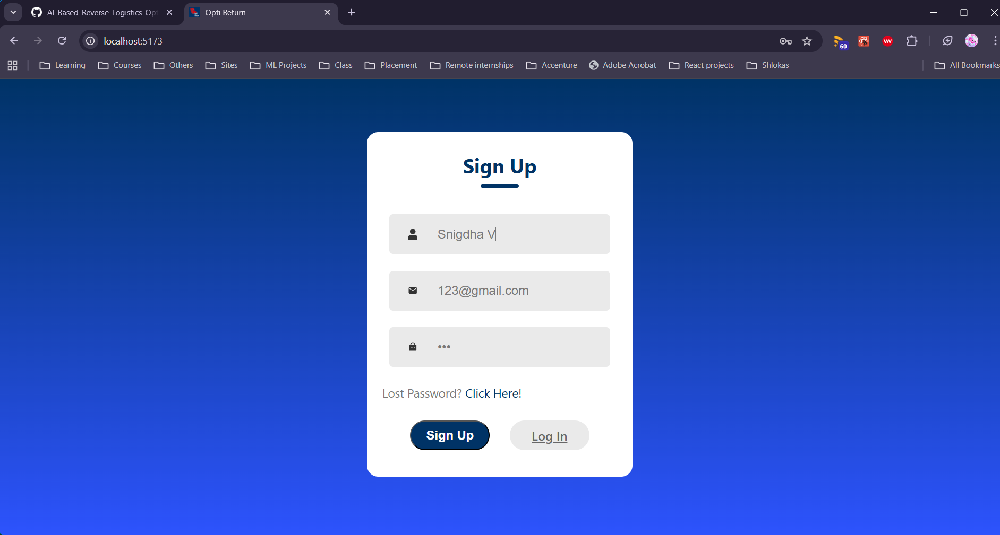
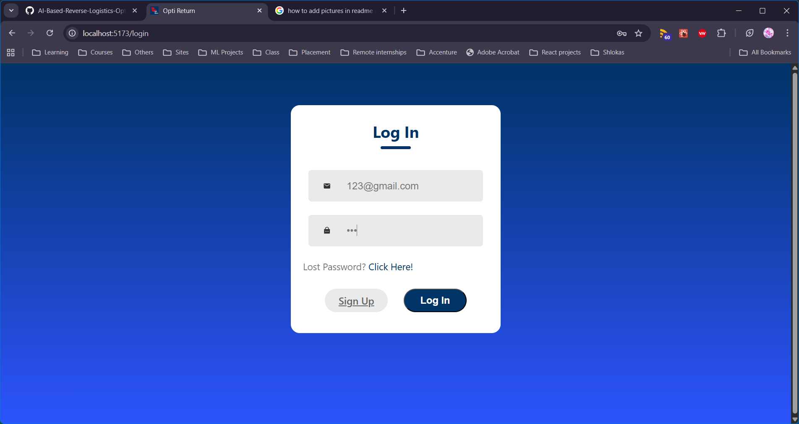
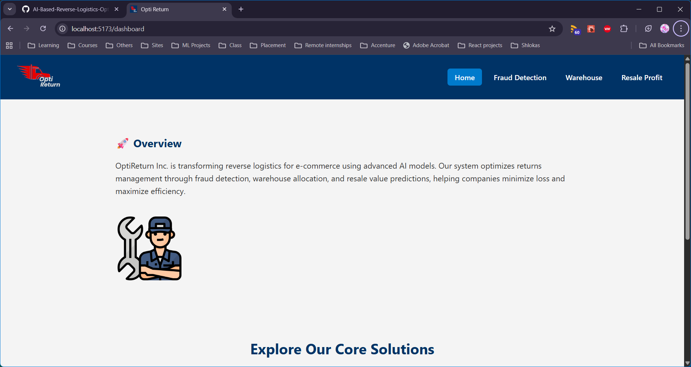
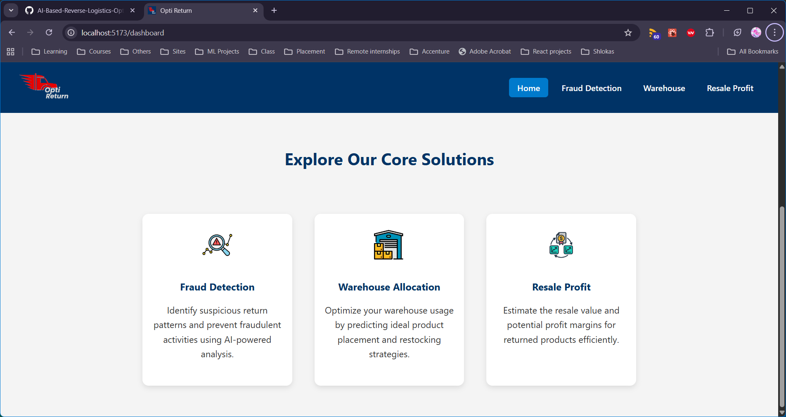
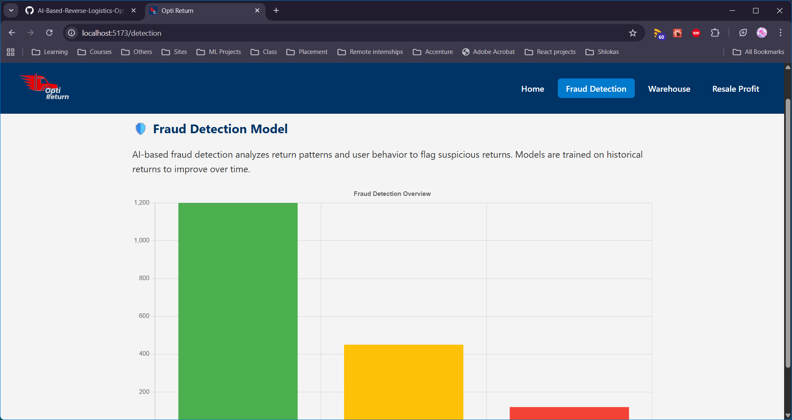
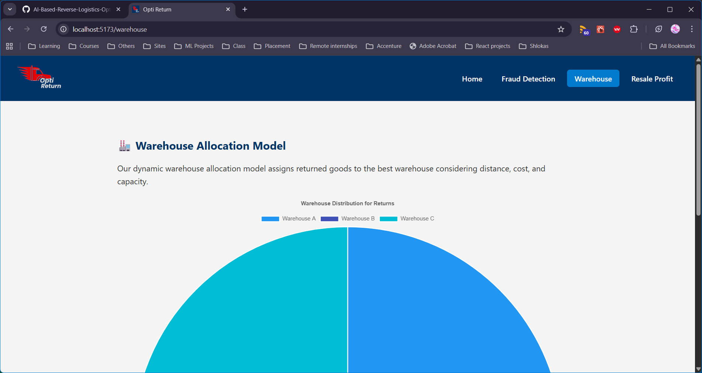
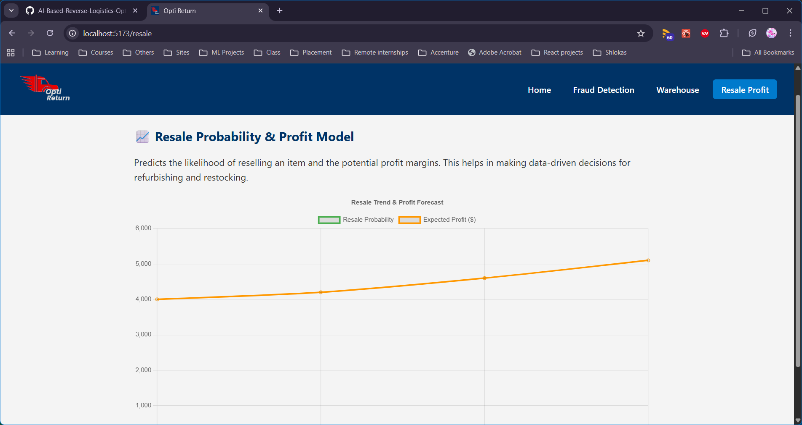

This is a front-end React project to make smart decisions refarding reverse logistics. 

In the e-commerce industry, returns are inevitable — often caused by product dissatisfaction, late delivery, or mismatch in expectations. Returned products need to be efficiently evaluated, re-categorized, and reintegrated into the supply chain. This process, known as Reverse Logistics, involves a lot of decision-making based on product condition, delivery metrics, and customer feedback.

<!-- SIGN UP PAGE -->

<!-- LOGIN PAGE -->

<!-- MAIN DASHBOARD -->

<!-- FRAUD DETECTION -->

<!-- WAREHOUSE -->

<!-- RESALE PROFIT -->

<!-- ICONS SOURCES -->
Detection icons created by HAJICON - Flaticon
Storage icons created by Nhor Phai - Flaticon
Arbitrage icons created by gravisio - Flaticon